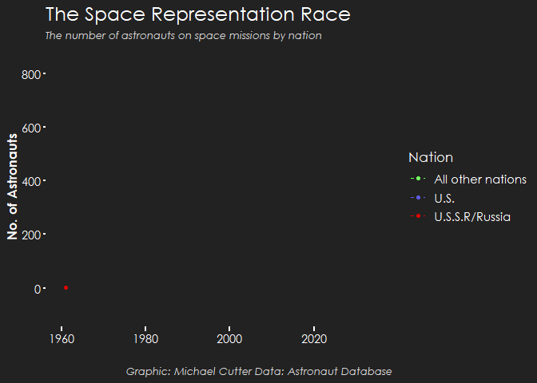

```{css, echo=FALSE}
.customcodechunk {
  background-color: #687F99;
  border: 3px solid #687F99;
  font-weight: bold;
  color: #FFFFFF;
}
```

------------------------------------------------------------------------

## Volcano Eruptions {.tabset .tabset-fade .tabset-pills}

### Plot

```{r echo=FALSE, warning=FALSE, message=FALSE}

source("tidytuesday2020wk20.R",print.eval = TRUE)


```

------------------------------------------------------------------------

### Code

```{r echo=TRUE,eval=FALSE, class.source = "customcodechunk"}
library(tidytuesdayR)
library(tidyverse)
library(extrafont)
library(scales)

eruptions <-
  readr::read_csv('https://raw.githubusercontent.com/rfordatascience/tidytuesday/master/data/2020/2020-05-12/eruptions.csv')

volcano <-
  readr::read_csv('https://raw.githubusercontent.com/rfordatascience/tidytuesday/master/data/2020/2020-05-12/volcano.csv')

Volcano_pops <-
  left_join(volcano,
    mutate_at(eruptions, "start_year", as.character),
    by = c("volcano_name", "last_eruption_year" = "start_year")
  ) %>%
  filter(!is.na(vei)) %>% 
  filter(across(contains("population")) > 0) %>% 
  mutate_at("vei", as.factor)


CPCOLS <-
  c("#261703FF",
    "#2E1D05FF",
    "#402808FF",
    "#E0B300FF",
    "#FA6400FF",
    "#E61300FF",
    "#801107",
    "#4A053FFF",
    "#4A053FFF")


volc_pops_plot <-  ggplot(Volcano_pops) +
  geom_histogram(color = NA, aes(x = population_within_5_km, fill = vei)) +
  scale_x_log10(labels = comma) +
  scale_fill_manual(
    values = CPCOLS,
    name = "Volcanic Explosivity Index",
    labels = c(
      "0 (Effusive)",
      "1 (Gentle)",
      "2 (Explosive)",
      "3 (Catastrophic)",
      "4 (Cataclysmic)",
      "5 (Paroxysmic)",
      "6 (Colossal)",
      "7 (Super-colossal)"
    )
  ) +
  theme(
    plot.background = element_rect(fill = "#222222", color = "#222222"),
    panel.background = element_rect(fill = "#222222", color = "#222222"),
    axis.ticks.x = element_line(
      colour = "white",
      size = 1,
      lineend = "square"
    ),
    axis.ticks.y = element_line(colour = "white",
                                size = 1),
    panel.grid.major.x = element_blank(),
    panel.grid.major.y = element_blank(),
    panel.grid.minor = element_blank(),
    plot.title = element_text(
      family = "Century Gothic",
      size = 18,
      color = "white"
    ),
    plot.subtitle = element_text(
      family = "Century Gothic",
      size = 9.5,
      color = "#D9D9D9",
      face = "italic"
    ),
    legend.title = element_text(
      family = "Century Gothic",
      size = 13,
      color = "white"
    ),
    legend.background = element_rect(fill = "#222222", color = "#222222"),
    legend.key = element_blank(),
    legend.text = element_text(
      family = "Century Gothic",
      size = 11,
      color = "white"
    ),
    axis.text.x = element_text(
      family = "Century Gothic",
      size = 11,
      color = "white"
    ),
    axis.text.y = element_text(
      family = "Century Gothic",
      size = 11,
      color = "white"
    ),
    axis.title.x = element_text(
      family = "Century Gothic",
      size = 12,
      color = "white",
      face = "bold"
    ),
    axis.title.y = element_text(
      family = "Century Gothic",
      size = 12,
      color = "white",
      face = "bold"
    )
  ) +
  labs(
    x = "\nPopulation within 5km of Eruption Site",
    y = "Frequency\n",
    title = "Living in the Danger Zone",
    subtitle = "The most recent eruptions of each volcano around the globe,\nand the number of people that were living dangerously close to the eruption site"
  )

volc_pops_plot
```

------------------------------------------------------------------------

<br>

## Spotify Songs {.tabset .tabset-fade .tabset-pills}

### Plot

```{r echo=FALSE, warning=FALSE, message=FALSE}

source("tidytuesday2020wk4.R",print.eval = TRUE)


```

------------------------------------------------------------------------

### Code

```{r echo=TRUE,eval=FALSE, class.source = "customcodechunk"}
library(tidytuesdayR)
library(tidyverse)
library(extrafont)
library(scales)


spotify_raw <- readr::read_csv('https://raw.githubusercontent.com/rfordatascience/tidytuesday/master/data/2020/2020-01-21/spotify_songs.csv')

spotify <- spotify_raw %>%
  mutate(track_album_release_year = str_sub(track_album_release_date, start = 1, end = 4) %>% 
           as.numeric) %>%
  filter(track_album_release_year >= 1970) %>%
  mutate(
    era = case_when(
      track_album_release_year %>% between(1970, 1979) ~ "'70s",
      track_album_release_year %>% between(1980, 1989) ~ "'80s",
      track_album_release_year %>% between(1990, 1999) ~ "'90s",
      track_album_release_year %>% between(2000, 2009) ~ "'00s",
      track_album_release_year %>% between(2010, 2019) ~ "'10s",
      track_album_release_year %>% between(2020, 2029) ~ "'20s",
    ) %>%
      fct_relevel(., "'70s", "'80s", "'90s", "'00s", "'10s", "'20s"),
    playlist_genre = as.factor(playlist_genre)
  ) %>%
  arrange(track_album_release_year)

levels(spotify$playlist_genre) <- c("EDM","Latin","Pop","R&B","Rap","Rock")


CPCOLS <- c("#1E4A35FF","#295E44","#25664A","#266E49FF","#2B7850","#399E6A","#3D7840")


genres_over_time <- 
  spotify %>%
  group_by(era) %>%
  ggplot() +
  geom_boxplot(aes(x = era, y = track_popularity, fill = era), colour = "#AFED8B", size = 0.6,
               outlier.colour = "#AFED8B", outlier.shape = 16, outlier.size = 1.25) +
  facet_wrap( ~ playlist_genre) +
  scale_fill_manual(name = "Era", values = CPCOLS[1:6]) +
  theme(
    plot.background = element_rect(fill = "#222222", color = "#222222"),
    panel.background = element_rect(fill = "#222222", color = "#222222"),
    panel.grid.major.x = element_blank(),
    panel.grid.major.y = element_line(colour = "#15883e", size = 0.01),
    panel.grid.minor = element_blank(),
    axis.ticks.x = element_line(colour = "#15883e",size = 1,lineend = "square"),
    axis.text = element_text(family = "Century Gothic",colour = "white", size = 9),
    strip.background = element_rect(colour = "#15883e", fill = CPCOLS[7]),
    strip.text = element_text(family = "Century Gothic",colour = "white", size = 12),
    axis.title.x = element_text(family = "Century Gothic",colour = "white", size = 14),
    axis.title.y = element_text(family = "Century Gothic",colour = "white", size = 14),
    plot.title = element_text(family = "Century Gothic",colour = "white", size = 18),
    plot.caption = element_text(family = "Century Gothic",colour = "white", size = 8),
    panel.border = element_rect(colour = "#15883e", fill = NA),
    legend.position = "none",
    plot.margin = margin(t = 10, r = 50, b = 5, l = 5, unit = "pt"),
    panel.spacing = unit(0.75, "lines")
  ) +
  labs(x = "\nMusic Era", y = "Track Popularity\n", title = "Song Popularity by Genre and Era",
       subtitle = "",caption = "Source: spotifyr - Song Genres\nVisualisation by Michael Cutter")

genres_over_time
```

------------------------------------------------------------------------

## Astronaut Nationalities {.tabset .tabset-fade .tabset-pills}


### Plot

```{r echo=FALSE, warning=FALSE, message=FALSE}

source("tidytuesday2020wk29.R",print.eval = TRUE)

```



------------------------------------------------------------------------

### Code

```{r echo=TRUE,eval=FALSE, class.source = "customcodechunk"}
library(tidytuesdayR)
library(tidyverse)
library(gganimate)
library(transformr)
library(extrafont)
library(scales)
library(rsvg)

# import fonts - only once
#font_import()
# load fonts - every session
loadfonts(device = "win", quiet = TRUE)


astronauts_raw <- readr::read_csv('https://raw.githubusercontent.com/rfordatascience/tidytuesday/master/data/2020/2020-07-14/astronauts.csv')

astronauts <- astronauts_raw %>%
  mutate(nation_final = case_when(nationality == "U.S." ~ "U.S.",
                                  nationality == "U.S.S.R/Russia" ~ "U.S.S.R/Russia",
                                  TRUE ~ "All other nations"))
space_race <- astronauts %>%
  select(id, nation_final, year_of_mission)

space_race <- space_race %>%
  group_by(nation_final, year_of_mission) %>%
  summarise(astronaut_count = n()) %>%
  mutate(cum_astronaut_count = cumsum(astronaut_count)) %>%
  arrange(year_of_mission) %>%
  ungroup() %>%
  mutate(year_id = group_indices(., year_of_mission),
         show_time = ifelse(year_of_mission == 1978, 20, 1)) %>%
  uncount(show_time)

space_race <- space_race %>%
  mutate(pause_year = ifelse(year_of_mission == 1978, "pause","no_pause")) %>%
  group_by(nation_final, pause_year) %>%
  mutate(reveal_time = ifelse(pause_year == "pause", row_number(), year_id)) %>%
  ungroup()

space_race <- space_race %>%
  group_by(nation_final, pause_year) %>%
  mutate(reveal_time_final = case_when(
    # in the year I want to pause at, I need to add 17 (the frame number before the pause)
    # to the row number generated for frames within the pause
    pause_year == "pause" ~ reveal_time + 17L,
    # the pause is for 20 frames, so I need to then add 19 to the frames to the rownumber after the pause
    pause_year == "no_pause" & year_of_mission > 1978 ~ year_id + 19L,
    TRUE ~ reveal_time)
         ) %>%
  ungroup() %>%
  mutate(reveal_time_final_label = paste(year_of_mission, reveal_time_final, sep = "_"),
         text = ifelse(year_of_mission == 1978,
                       "Space representation begins to widen in 1978,\n with Astronauts from Czechoslovakia, Germany,\n and Poland joining missions in space"," "))

CPCOLS <- c("#71FF5EFF","#5C5CE6FF","#D90707FF")

space_race_plot <- space_race %>%
  ggplot(aes(x = year_of_mission, y = cum_astronaut_count,
             colour = factor(nation_final), label = text)) +
  geom_line(linetype = "dashed") +
  geom_point() +
  geom_text(aes(x = 1960, y = 200), size = 4, hjust = 0, colour = "white") +
  scale_colour_manual(
    values = CPCOLS,
    name = "Nation") +
  theme(
    plot.background = element_rect(fill = "#222222", color = "#222222"),
    panel.background = element_rect(fill = "#222222", color = "#222222"),
    axis.ticks.x = element_line(
      colour = "white",
      size = 1,
      lineend = "square"
    ),
    axis.ticks.y = element_line(colour = "white",
                                size = 1),
    panel.grid.major.x = element_blank(),
    panel.grid.major.y = element_blank(),
    panel.grid.minor = element_blank(),
    plot.title = element_text(
      family = "Century Gothic",
      size = 18,
      color = "white"
    ),
    plot.subtitle = element_text(
      family = "Century Gothic",
      size = 9.5,
      color = "#D9D9D9",
      face = "italic"
    ),
    plot.caption = element_text(
      family = "Century Gothic",
      size = 9.5,
      color = "#D9D9D9",
      face = "italic"
    ),
    legend.title = element_text(
      family = "Century Gothic",
      size = 13,
      color = "white"
    ),
    legend.background = element_rect(fill = "#222222", color = "#222222"),
    legend.key = element_blank(),
    legend.text = element_text(
      family = "Century Gothic",
      size = 11,
      color = "white"
    ),
    axis.text.x = element_text(
      family = "Century Gothic",
      size = 11,
      color = "white"
    ),
    axis.text.y = element_text(
      family = "Century Gothic",
      size = 11,
      color = "white"
    ),
    axis.title.x = element_text(
      family = "Century Gothic",
      size = 12,
      color = "white",
      face = "bold"
    ),
    axis.title.y = element_text(
      family = "Century Gothic",
      size = 12,
      color = "white",
      face = "bold"
    )
  ) +
  scale_x_continuous(limits = c(NA, 2035)) +
  scale_y_continuous(limits = c(-100, NA)) +
  labs(y = "No. of Astronauts", x = "", title = "The Space Representation Race",
       subtitle = "The number of astronauts on space missions by nation",
       caption = "Graphic: Michael Cutter Data: Astronaut Database")

space_race_plot_anim <- space_race_plot +
  transition_reveal(reveal_time_final)

anim_save(filename = "space_race_plot_anim.gif", space_race_plot_anim, duration = 20, start_pause = 3, end_pause = 6)


```

------------------------------------------------------------------------

```{r setup, include=FALSE}
knitr::opts_chunk$set(echo = TRUE)
```
